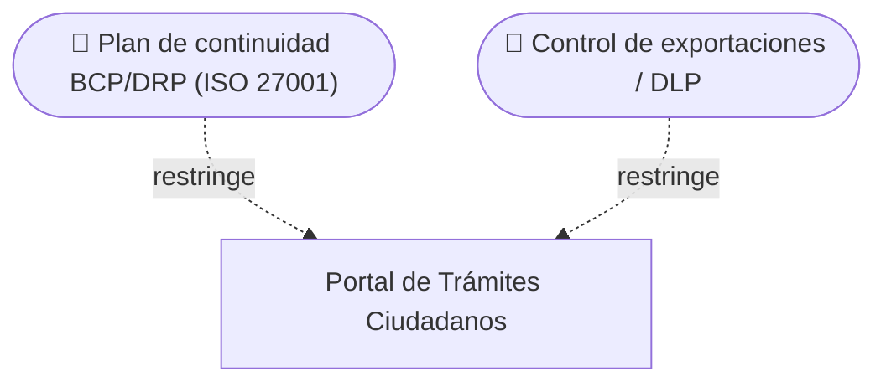

# 🗒️ Registro de Trabajo en Clase - Taller 6

## 📆 Fecha de la sesión
_(completar con la fecha de la clase)_

## 👥 Integrantes presentes
- Integrante 1
- Integrante 2
- Integrante 3

## 🧠 Actividades realizadas en clase

- **Qué se discutió:** se aplicó la metodología de 5 pasos al caso base **GobData**, el portal de trámites ciudadanos. Primero se identificaron los datos sensibles: cédula, historial clínico (dato sensible de salud, con tratamiento reforzado según la Ley 1581), dirección, certificados digitales y trazabilidad de trámites. Luego se asoció cada uno a su marco normativo (Ley 1581 o ISO 27001).
- **Decisiones tomadas:**
  - Se usaron solo los dos estados de la plantilla oficial (✅ Cumple / ⚠️ Parcial). "Brecha" no es un estado: es una fila de la hoja Brechas Identificadas.
  - De los 12 ítems de `checklist-gobdata.xlsx`, 7 cumplen y 5 quedan en Parcial (#2 revocatoria, #5 BCP/DRP, #8 DLP, #10 anonimización, #12 formación). Esos 5 son las brechas.
  - Brechas de riesgo **Alto**: no hay plan formal de continuidad y la exportación manual no está controlada. Son las más graves porque afectan la disponibilidad del servicio público y exponen datos de salud.
  - Cada recomendación se redactó para corregir directamente la brecha (por ejemplo, DLP para la exportación manual, en vez de una recomendación genérica de "mejorar la seguridad").
- **Herramientas usadas:** plantilla oficial en Excel, la guía paso a paso y la visualización interactiva `visualizacion-normatividad.html`.
- **Avance en clase:** se revisó el checklist de GobData completo y se validó con la checklist de autoevaluación (sección 5 de la guía). Se acordó reutilizar las mismas categorías con Asul y agregar las de **Cumplimiento Sectorial (SFC)** y **Transferencia Internacional**, porque su cliente principal (SBS Seguros) es una aseguradora vigilada y los datos se alojan en Azure en Estados Unidos.

## 🧩 Boceto inicial del modelo

Vista ArchiMate de la brecha principal de GobData, según la guía:

## 🔁 Tareas definidas para complementar el taller

| Tarea asignada | Responsable | Fecha estimada |
|----------------|-------------|----------------|
| Depurar la transcripción de la entrevista con Asul | Integrante 1 | _(fecha)_ |
| Diligenciar `entrega/checklist-cliente.xlsx` (22 ítems + brechas) | Integrante 2 | _(fecha)_ |
| Redactar `entrega/informe.md` | Integrante 3 | _(fecha)_ |
| Investigar la normativa SFC (CE 007/2018, CE 005/2019) y armar `entrega/referencias.md` | Integrante 1 | _(fecha)_ |
| Validar con Asul los puntos abiertos (Rentech, requisitos SFC, pruebas de restauración) | Todos | _(fecha)_ |

---

_Este documento resume el trabajo colaborativo realizado durante la sesión del taller 6 en el curso AREM - Universidad de La Sabana._
