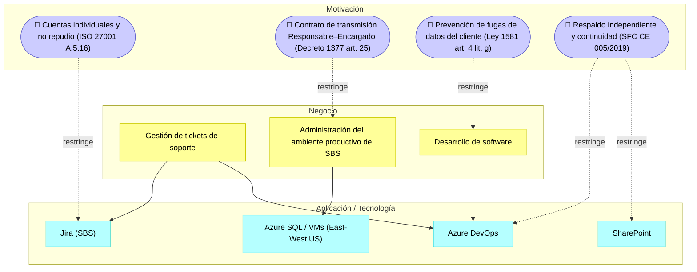

# 📄 Informe Técnico del Taller

## 🔖 Nombre del Taller
_Taller 6 - Checklist de Cumplimiento Normativo_

## 👥 Integrantes del equipo
Nicolás Clavijo
Mauricio Suárez

## 🧠 Descripción general del trabajo

El taller verifica qué aspectos legales, normativos y de cumplimiento aplican al sistema de un cliente real. Para eso se usan listas de control basadas en la Ley 1581 de 2012 (Habeas Data), su Decreto reglamentario 1377 de 2013 e ISO/IEC 27001, además de la normativa del sector que corresponda.

Nuestro cliente es **Asul**, una empresa de desarrollo y soporte de software con un equipo de menos de 10 personas. El sistema evaluado es el **ecosistema de desarrollo, soporte y operación** con el que Asul atiende a sus clientes. El caso principal es **SBS Seguros Colombia**, una aseguradora vigilada por la Superintendencia Financiera (SFC). Para SBS, Asul desarrolla y además administra el ambiente productivo alojado en Microsoft Azure. Los tickets llegan desde el Jira del cliente y se gestionan en Azure DevOps, mientras que la documentación de requisitos vive en SharePoint.

En la Parte 1 se hizo el análisis de GobData en clase (ver `clase/notas.md`). Después se aplicó la misma metodología de 5 pasos a Asul, usando como fuente la entrevista realizada a la empresa (transcripción de aprox. 23 minutos). Los minutos citados en el checklist corresponden a esa transcripción.

## 🔧 Proceso de desarrollo

1. **Depuración de la transcripción.** Se generó automáticamente y tiene muchos errores fonéticos, así que primero se normalizaron los términos: "ashur de bobs" = Azure DevOps, "cherpoint / shore" = SharePoint, "gira" = Jira, "6 square / ashure ese cuele" = Azure SQL, "Microsoft 65 entra" = Microsoft 365 / Entra ID, "PPN / BPMS" = VPN, "money monitor" = Azure Monitor, "knock / shock" = NOC / SOC.
2. **Paso 1 – Datos sensibles.** Se identificó qué información toca Asul y qué norma aplica a cada una (tabla abajo).
3. **Paso 2 – Checklist.** Se tomaron las categorías de la plantilla oficial (Consentimiento, Seguridad ISO 27001, Protección de Datos, Prevención de Fugas, Retención, Roles) y se añadieron dos que exige el contexto del cliente: **Cumplimiento Sectorial (SFC)** y **Transferencia Internacional**, porque los datos de una aseguradora colombiana se alojan en Azure en Estados Unidos.
4. **Paso 3 – Evaluación.** Cada uno de los 22 ítems se marcó como ✅ Cumple o ⚠️ Parcial, citando el minuto de la entrevista como evidencia. La plantilla solo admite esos dos estados, así que los controles inexistentes se marcaron Parcial cuando existía al menos una política o un control compensatorio.
5. **Pasos 4 y 5 – Riesgo y priorización.** Cada Parcial se volvió una fila en la hoja **Brechas Identificadas**, con su riesgo legal u operativo, la norma asociada, una recomendación concreta y una prioridad.

Herramientas: plantilla oficial `plantilla_checklist.xlsx` (diligenciada en `entrega/checklist-cliente.xlsx`), consulta de las normas en el Gestor Normativo de Función Pública y en la SFC.

## 🧩 Análisis del modelo propuesto

### Paso 1 — Datos y procesos sensibles de Asul

| Dato / Proceso | Rol de Asul | Sensibilidad | Normativa aplicable |
|---|---|---|---|
| Base de datos productiva de SBS (pólizas, asegurados, posibles datos de salud en seguros de vida/salud) | Encargado del tratamiento | Dato personal y posiblemente sensible | Ley 1581, Decreto 1377 art. 25, CE SFC 007/2018 y 005/2019 |
| Copias de la BD en ambientes de prueba | Encargado | Se ofuscan antes de usarse | Ley 1581 art. 4 (seguridad, acceso restringido) |
| Tickets de soporte (Jira de SBS → Azure DevOps) | Encargado | Pueden contener datos de asegurados | Ley 1581, ISO 27001 (trazabilidad) |
| Código fuente de los productos del cliente | Custodio | Propiedad intelectual / confidencial | Cláusulas de confidencialidad, ISO 27001, Ley 1273 |
| Documentos de requisitos y estimaciones aprobados por correo | Custodio | Valor contractual | Ley 527 de 1999 |
| Datos de empleados y candidatos de Asul | Responsable del tratamiento | Dato personal | Ley 1581, Decreto 1377 |
| Credenciales y accesos (Entra ID, Jira, IPs autorizadas) | Custodio | Crítico para la seguridad | ISO 27001 A.5.15–A.5.18, CE 005/2019 |

### Pasos 3–5 — Resumen del checklist

El detalle de los 22 ítems está en la hoja **Checklist General** de `checklist-cliente.xlsx`.

| Categoría | Ítems | ✅ Cumple | ⚠️ Parcial |
|---|---|---|---|
| Consentimiento (Ley 1581) | 3 | 2 | 1 |
| Seguridad (ISO 27001) | 8 | 4 | 4 |
| Protección de Datos | 4 | 2 | 2 |
| Prevención de Fugas | 1 | 0 | 1 |
| Retención | 1 | 0 | 1 |
| Roles y Responsabilidades | 3 | 2 | 1 |
| Cumplimiento Sectorial (SFC) | 1 | 0 | 1 |
| Transferencia Internacional | 1 | 1 | 0 |
| **Total** | **22** | **11** | **11** |

**Fortalezas encontradas:** Asul tiene política de Habeas Data publicada y un canal para ejercer derechos. Usa identidad centralizada en Entra ID con MFA en todas las cuentas y restringe el acceso a producción por IP. La infraestructura se replica entre East US y West US, con pruebas de recuperación ante desastres. Los datos productivos se ofuscan antes de pasar a pruebas, hay roles diferenciados en Azure DevOps, auditorías semestrales de seguridad al personal y trazabilidad por historial en las tres herramientas.

### Brechas priorizadas y recomendaciones

| # | Categoría | Brecha | Riesgo | Recomendación prioritaria | Prioridad |
|---|---|---|---|---|---|
| 1 | Seguridad | Cuenta de Jira compartida por todo el equipo | Alto | Licencias nominales o integración Jira–Azure DevOps; mientras tanto, gestor de secretos con MFA y bitácora de uso | Alta |
| 2 | Consentimiento | Sin contrato de transmisión con SBS como Encargado | Alto | Anexo de transmisión (Decreto 1377 art. 25) | Alta |
| 3 | Prevención de Fugas | Sin control técnico de descargas en equipos individuales | Alto | Microsoft Purview DLP, Intune y acceso condicional | Alta |
| 4 | Seguridad | Backup de SharePoint en un solo PC, sin backup de Azure DevOps, sin BCP/DRP | Alto | Respaldo gestionado de M365 y DevOps, BCP/DRP con RPO/RTO | Alta |
| 5 | Roles | Dependencia de una persona para despliegues y la cuenta de Jira | Alto | Runbooks, dos o más personas habilitadas, segregación de funciones | Alta |
| 6 | Sectorial (SFC) | No se conocen los requisitos SFC exigibles a Asul como tercero | Medio | Análisis de brechas frente a las CE 007/2018 y 005/2019 con SBS | Alta |
| 7 | Seguridad | Despliegues manuales sin CI/CD | Medio | Azure Pipelines con aprobaciones | Media |
| 8 | Retención | Código y documentos guardados indefinidamente | Medio | Política de retención por cliente y eliminación o anonimización | Media |
| 9 | Protección de Datos | Sin oficial de protección de datos designado | Medio | Designación formal (Decreto 1377 art. 23) | Media |
| 10 | Seguridad | Sin evidencia de pruebas de restauración | Medio | Pruebas trimestrales con acta | Media |
| 11 | Protección de Datos | Requisitos aprobados sin bloqueo de versión | Bajo | Línea base en solo lectura y firma electrónica | Baja |

**Justificación de la priorización:** las brechas 1 a 5 son de riesgo alto porque afectan de forma directa la confidencialidad o la disponibilidad de datos de una aseguradora vigilada. Además, pueden causar sanciones de la SIC (Ley 1581 art. 23: multas de hasta 2.000 SMMLV) o implicaciones penales (Ley 1273 art. 269F). La brecha 6 tiene riesgo medio, pero prioridad alta: de ella dependen otras exigencias contractuales, y la CE 005/2019 pide al vigilado mantener bajo su control la administración de usuarios, contar con respaldo independiente y usar MFA para el acceso administrativo, justo donde aparecen las brechas 1 y 4. Las brechas 7 a 11 son mejoras de madurez sin exposición inmediata de datos.

### Vista ArchiMate equivalente

Como indica la guía, cada brecha de alta prioridad se modela como una **Constraint** que restringe al proceso o componente donde ocurre. Estas Constraints serán insumo de los `Gap` del TO-BE en el Taller 7.

### Supuestos tomados

- La transcripción automática tiene errores. Los términos se normalizaron como se explicó arriba y cada hallazgo se citó con el minuto para que se pueda verificar.
- **SBS** se interpreta como **SBS Seguros Colombia S.A.**, entidad vigilada por la SFC. Por eso se incluyó la normativa del sector asegurador.
- "**Rentech**" aparece como el nombre con el que SBS identifica a Asul en Jira (asignación de tickets, cuenta de correo). No se pudo confirmar si es otra razón social de Asul o un tercero, así que queda como punto a validar con la empresa.
- "No tenemos [backup]" se interpretó como que **Azure DevOps no tiene respaldo propio**. Solo SharePoint se respalda.
- Las preguntas sin respuesta clara (pruebas de restauración del código, requisitos SFC contractuales, responsable de protección de datos) se evaluaron como Parcial y no como Cumple, en línea con el error común "marcar Cumple sin evidencia".
- No se evaluó la obligación de inscribir bases en el Registro Nacional de Bases de Datos (RNBD). Desde el Decreto 090 de 2018 solo aplica a sociedades con activos totales superiores a 100.000 UVT, y no tenemos información financiera de Asul. Queda como verificación pendiente.

## 🔍 Investigación complementaria

### Tema investigado:
Normativa sectorial de la Superintendencia Financiera de Colombia aplicable a proveedores tecnológicos de aseguradoras, y rol de "Encargado del tratamiento" bajo la Ley 1581.

### Resumen:

Como SBS Seguros es una entidad vigilada por la SFC, Asul queda dentro de la cadena de cumplimiento del sector financiero aunque la SFC no la vigile directamente. La **Circular Externa 007 de 2018** adicionó el Capítulo V al Título IV de la Parte I de la Circular Básica Jurídica (CE 029 de 2014). Allí fija los requerimientos mínimos de gestión del riesgo de ciberseguridad: políticas aprobadas por la junta, una unidad de ciberseguridad, un esquema de prevención, detección y respuesta a incidentes, y cifrado de la información. En la práctica, las entidades vigiladas trasladan estas exigencias a sus terceros por contrato. Por eso la brecha de "requisitos SFC no conocidos" se priorizó alto: SBS responde ante la SFC por lo que Asul hace en su ambiente productivo.

La **Circular Externa 005 de 2019** (Capítulo VI, Título I, Parte I de la CBJ) regula el uso de servicios de computación en la nube por parte de los vigilados. Entre sus obligaciones generales exige verificar que el proveedor de nube tenga certificación ISO 27001 (y referencias como ISO 27017/27018 e informes SOC), contar con respaldo de la información procesada en la nube que esté disponible e independiente, mantener cifrada la información confidencial en tránsito y en reposo, conservar el control de la administración de usuarios y privilegios con MFA para el acceso administrativo, y verificar que las jurisdicciones donde se procesa la información tengan protección de datos equivalente o superior a la colombiana. Esto se relaciona directamente con cuatro hallazgos: la cuenta de Jira compartida, la falta de backup de Azure DevOps y el respaldo débil de SharePoint, la ubicación de los datos en East/West US y la ausencia de certificación ISO 27001 propia de Asul.

Por último, frente a SBS, Asul actúa como **Encargado del tratamiento** (Ley 1581 art. 3 lit. d): trata datos por cuenta de otro. El **artículo 25 del Decreto 1377 de 2013** exige que el Responsable y el Encargado firmen un contrato de transmisión que fije los alcances del tratamiento y obligue al Encargado a aplicar la política del Responsable, proteger la seguridad de las bases y guardar confidencialidad. La cláusula de confidencialidad que mencionó Asul cubre solo una parte de esto. Para la transferencia de datos a Estados Unidos (Azure), el art. 26 de la Ley 1581 prohíbe enviar datos a países sin nivel adecuado de protección, pero la **Circular Externa 005 de 2017 de la SIC** incluye a Estados Unidos entre los países adecuados, así que el alojamiento actual es viable si se documenta. Por su parte, la aprobación de requisitos por correo es válida como mensaje de datos gracias a la equivalencia funcional de la **Ley 527 de 1999** (arts. 6–8), siempre que se garantice la integridad del documento aprobado. De ahí sale la recomendación de bloquear las líneas base.

## 📚 Referencias

Ver el listado completo en [`referencias.md`](referencias.md).

---

_Este documento hace parte de la entrega del taller 6 del curso AREM (Arquitectura Empresarial) - Universidad de La Sabana._
